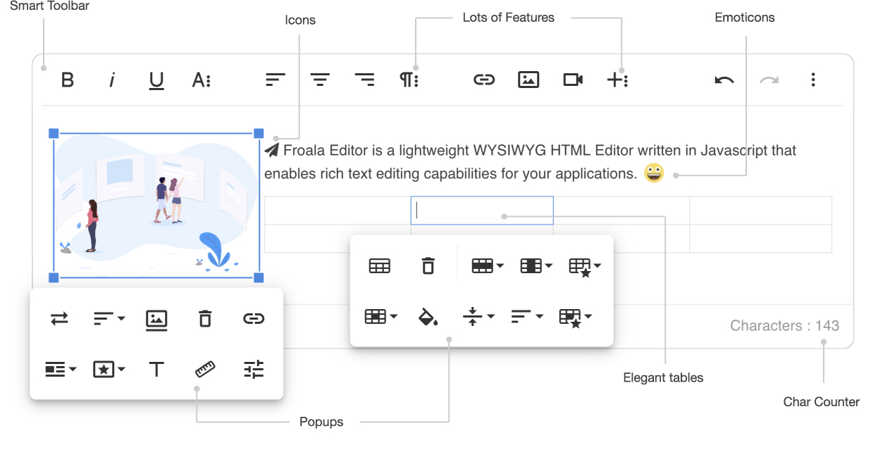

# Froala WYSIWYG editor for Craft CMS (v3)

The implementation of the Froala Editor (license not included) for Craft CMS (v3)

__[Check the Craft CMS v2 version here](https://github.com/froala/Craft-Froala-WYSIWYG/)__



## Installation

You can install this plugin from the Plugin Store or with Composer.

#### From the Plugin Store

Go to the Plugin Store in your project's Control Panel and search for "Froala". Then click on the "Install" button in its modal window.

#### With Composer

Open your terminal and run the following commands:

```bash
# go to the project directory
cd /path/to/my-project

# tell Composer to load the plugin
composer require froala/craft-froala-wysiwyg

# tell Craft to install the plugin
./craft install/plugin froala-editor
```

## Known issue (help wanted!)

Adding links to Craft Entries causing issues when you double click on the entry to link to. Just click once and use the "Select" button.

Sorry for the inconvience. We're working on these annoying issues. But we decided to release a new version because of some missing important other features (like saving links the Craft way).

## Configuration

### Froala Configs

You can create custom configs that will be available to your Froala fields. They should be created as JSON files in your `config/froalaeditor/` folder.

For example, if you created a `config/froalaeditor/Simple.json` file with the following content:

```json
{
  "toolbarButtons": [
    "bold", "italic", "underline", "strikeThrough", "formatOL", "formatUL", "insertHR", "|",
    "undo", "redo", "|", "paragraphFormat", "paragraphStyle", "|", "html"
  ],
  "paragraphFormat": {
    "N": "Normal",
    "H1": "Heading 1",
    "H2": "Heading 2",
    "H3": "Heading 3",
    "H4": "Heading 4"
  }
}
```

…then a "Simple" option would become available within the config section on your Froala field’s settings.

See the [Froala documentation](https://www.froala.com/wysiwyg-editor/docs/options) for a list of available config options and buttons.

## Third party plugins

```html
<!-- Include third party plugins -->
<link href="https://cdnjs.cloudflare.com/ajax/libs/font-awesome/4.7.0/css/font-awesome.min.css" rel="stylesheet" type="text/css" />
<script src="../../js/third_party/font_awesome.min.js"></script>
<script src="../../js/third_party/spell_checker.min.js"></script>
<script src="../../js/third_party/embedly.min.js"></script>
<script src="../../js/third_party/image_tui.min.js"></script> 
<link rel="stylesheet" href="../../css/third_party/image_tui.min.css">
```

### HTML Purifier Configs

Froala fields use [HTML Purifier](http://htmlpurifier.org) to ensure that no malicious code makes it into its field values, to prevent XSS attacks and other vulnerabilities.

You can create custom HTML Purifier configs that will be available to your Froala fields. They should be created as JSON files in your `config/htmlpurifier/` folder.

Use this as a starting point, which is the default config that Froala fields use if no custom HTML Purifier config is selected:

```json
{
    "Attr.AllowedFrameTargets": ["_blank"],
    "Attr.EnableID": true,
    "HTML.AllowedComments": ["pagebreak"]
}
```

(The [HTML.AllowedComments](http://htmlpurifier.org/live/configdoc/plain.html#HTML.AllowedComments) option is required for the `pagebreak` plugin.)

See the [HTML Purifier documentation](http://htmlpurifier.org/live/configdoc/plain.html) for a list of available config options.

## Contributing

If you have any issue regarding the editor itself, please report your issue on the [main repository](https://github.com/froala/wysiwyg-editor) itself.

You can raise an issue here if you have found a problem in the integration with Craft CMS v3.

If you already have fixed the bug yourself, please create a Pull Request (PR) and send us the fixes with a detailed description of the problem and the fix. Please PR your changes on our **develop branch**.

Any help will be appreciated. Many thanks.

## License

To enable the editor correctly, you should have a purchased a license on [www.froala.com](https://www.froala.com/wysiwyg-editor/pricing).

Once you have a license, for your domain, you can enter the license key in the plugin settings.