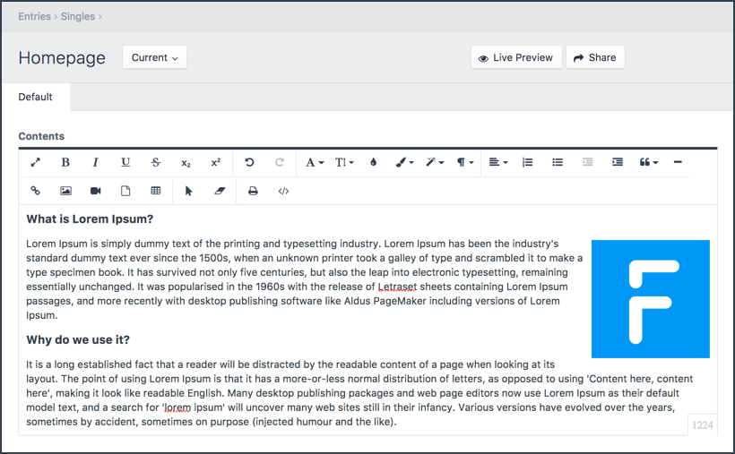

# Froala WYSIWYG editor for Craft CMS (v3)

The implementation of the Froala Editor (license not included) for Craft CMS (v3)

__[Check the Craft CMS v2 version here](https://github.com/froala/Craft-Froala-WYSIWYG/blob/master/README.md)__



## Installation

Tell composer to load the plugin

```terminal
composer require froala/craft-froala-wysiwyg
```

## Get your license

To enable the editor correctly, you should have a purchased a license on [www.froala.com](https://www.froala.com/wysiwyg-editor/pricing).

Once you have a license, for your domain, you can enter the license key in the plugin settings.

## Todo's

We're working on the Craft CMS v3 implementation. A couple of things have to be fixed before we will guarantee the plugin to work. Please be a little patience.

- [x] Settings to enable/disable editor plugins
- [x] Field settings to override enable/disable plugins
- [x] Using Craft modals for uploading/selecting images
- [ ] Updating links to images and using Craft Entries
- [x] Using Craft modals for uploading/selecting files
- [x] Add ability to link to other entries in the system
- [ ] Add ability register plugins from other resources than the editor
- [ ] Tweaking the plugin needs (releases.json, etc.)
- [ ] Fixing UI issues regarding Craft's new flex-model.

## License

Froala Editor is a beautiful WYSIWYG editor for editing web pages.

Therefor the editor needs a license. You can buy one at [the website](https://www.froala.com/wysiwyg-editor/pricing).

Once purchased a license, you can enter the license key in your Craft CMS settings page.